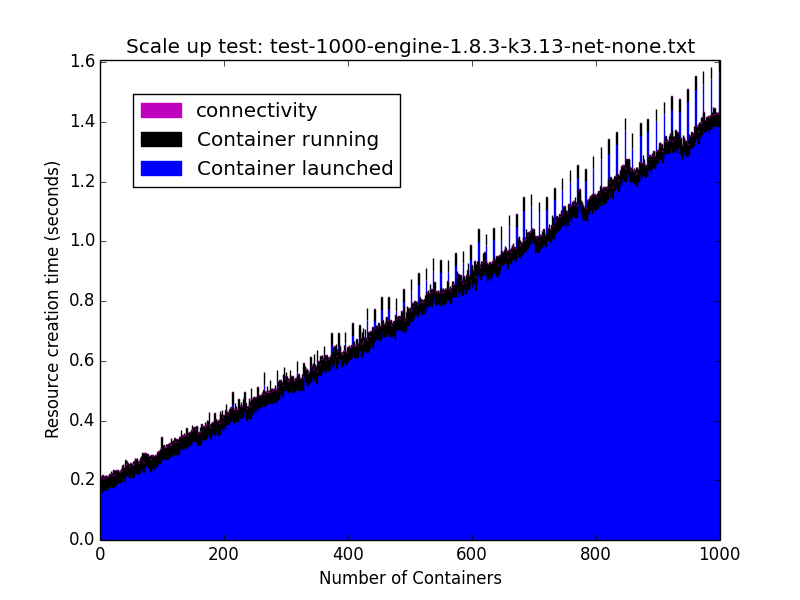
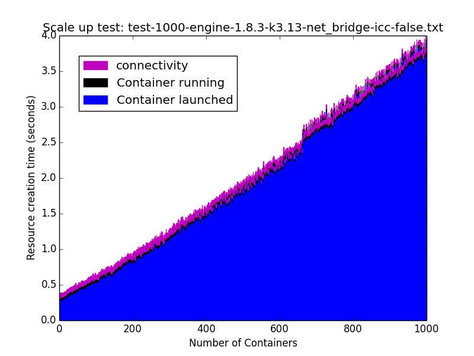
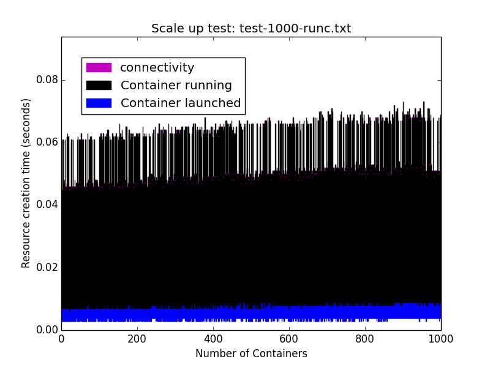
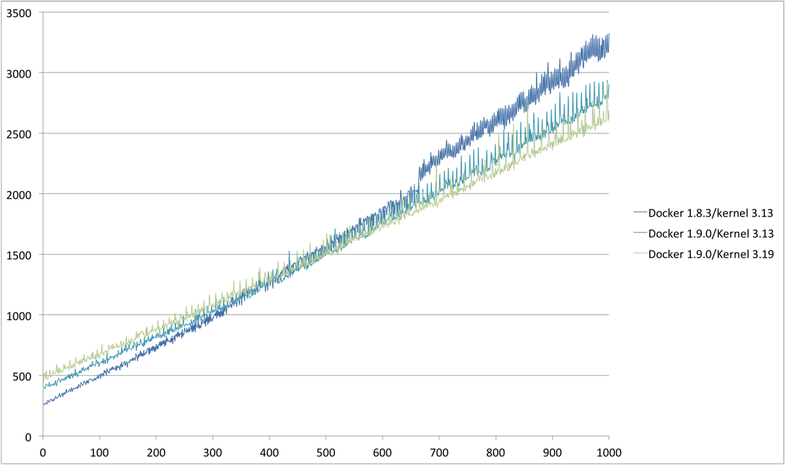

# Docker engine scalability tests

## Environment tested

All tests are performed on a SoftLayer Public Instance type VM.

Hosts
```
SoftLayer Public CCIs
8 CPUs, 16 GB RAM
Ubuntu 14.04 LTS 64 bits
Kernel: Linux 3.19.0-31-generic #36~14.04.1-Ubuntu SMP Thu Oct 8 10:21:08 UTC 2015 x86_64 x86_64 x86_64 GNU/Linux
```
or:

```
Linux 3.13.0-65-generic #105-Ubuntu SMP Mon Sep 21 18:50:58 UTC 2015 x86_64 x86_64 x86_64 GNU/Linux
```
Docker version:
```
Client:
 Version:      1.9.0
 API version:  1.21
 Go version:   go1.4.2
 Git commit:   76d6bc9
 Built:        Tue Nov  3 17:43:42 UTC 2015
 OS/Arch:      linux/amd64

Server:
 Version:      1.9.0
 API version:  1.21
 Go version:   go1.4.2
 Git commit:   76d6bc9
 Built:        Tue Nov  3 17:43:42 UTC 2015
 OS/Arch:      linux/amd64
```
or (for comparison with older version of Docker):

```
Docker version:
Client:
 Version:      1.8.3
 API version:  1.20
 Go version:   go1.4.2
 Git commit:   f4bf5c7
 Built:        Mon Oct 12 05:37:18 UTC 2015
 OS/Arch:      linux/amd64

Server:
 Version:      1.8.3
 API version:  1.20
 Go version:   go1.4.2
 Git commit:   f4bf5c7
 Built:        Mon Oct 12 05:37:18 UTC 2015
 OS/Arch:      linux/amd64
```
RunC
```
https://github.com/opencontainers/runc/tree/v0.0.4
```

## Benchmark:

The test executes sequentially the steps below:

1. Start container on docker engine with busybox image and httpd server with different networking options (e.g. net=none, docker bridge, icc=true or icc=false)

2. Capture the time it takes for docker run to return - 'Container Launched'

3. Use inspect on launched container to find out when it goes to 'Running' state - 'Container Running'

4. Measure time to TCP connectivity

Note that we wait for completion of each step before starting the next one.

## Results

### Docker Engine with no Network
Execute sequentially the steps below:
1. Start container on node with busybox image, no docker networking (--net=none) - to make the test comparable with the one with network, we launch also the HTTPD process as in the networked test using:
```
docker run --name $container -tid -busybox httpd -f -p 3000 )
```
2. Capture the time it takes for docker run to return - 'Container Launched'

3. Use inspect on launched container to find out when it goes to 'Running' state - 'Container Running'



### Docker Engine with default Docker Bridge Network and icc=true
Execute sequentially the steps below:
1. Start container on node with busybox image, default docker networking, and httpd in foreground
```
docker run --name $container -tid -p $port:3000 busybox httpd -f -p 3000
```
2. Capture the time it takes for docker run to return - 'Container Launched'

3. Use inspect on launched container to find out when it goes to 'Running' state - 'Container Running'

4. Measure the time required to open a TCP connection to the httpd process in the container


### Docker Engine with default Docker Bridge Network and icc=false

In this particular test we want to test if adding IP table rules is affecting performances.

Execute sequentially the steps below:

1. Start a source container, publishing a port

2. Start container on node with busybox image, default docker networking, and httpd in foreground:
```
docker run --name $container --link cont0:cont0 -tid -p $port:3000 busybox httpd -f -p 3000
```
this will force the generation of extra IPtable rules for each new container

3. Capture the time it takes for docker run to return - 'Container Launched'

4. Use inspect on launched container to find out when it goes to 'Running' state - 'Container Running'

5. Measure the time required to open a TCP connection to the httpd process in the container



### OpenContainer runC tool
The steps used here are similar to docker with no network. Note that we did not create a network stack (equivalent to --net=HOST) and we did not copy the root FS for each new container (read only filesystem):

1. Start runC container on node with busybox image, no network namespace - to make the test comparable with the one with network, we launch also the HTTPD process as in the networked test (runc --id <container-id> start  & ) - run it in background as runC does not have a '-d' option

2. Capture the time it takes for command to return ('container launched')

3. Check process is started by testing when connectivity to httpd port (on host, since we did not placed network stack in namespace)

Note also the very different scale used for runC.



### Comparison with docker 1.9.0 and kernel 3.19

We repeated the same tests for icc=true and docker bridge with docker 1.9.0, linux kernel 3.13 and docker 1.9.0, linux kernel 3.19.


