# Swarm on Mesos scalability tests

## Environment tested

All tests are performed in a cluster of 10 or 20 nodes of SoftLayer virtual machines.

Hosts:
```
SoftLayer Public CCIs
1 master: 8 CPU / 16 GB RAM
10/20 workers: 8 CPU / 16 GB RAM
Ubuntu 14.04 LTS 64 bits
Kernel: Linux 3.19.0-31-generic #36~14.04.1-Ubuntu SMP Thu Oct 8 10:21:08 UTC 2015 x86_64 x86_64 x86_64 GNU/Linux
```
Docker version:
```
Client:
 Version:      1.9.0
 API version:  1.21
 Go version:   go1.4.2
 Git commit:   76d6bc9
 Built:        Tue Nov  3 17:43:42 UTC 2015
 OS/Arch:      linux/amd64

Server:
 Version:      1.9.0
 API version:  1.21
 Go version:   go1.4.2
 Git commit:   76d6bc9
 Built:        Tue Nov  3 17:43:42 UTC 2015
 OS/Arch:      linux/amd64
```
Mesos:
```
version 0.25.0
```
Swarm:
```
version 1.0.0 (official image from Docker Hub - https://hub.docker.com/_/Swarm/ )
```
For non-Marathon managed Swarm, we start Swarm with:
```
docker run -e Swarm_MESOS_USER=root -d -p 4375:2375 -p 3376:3375 --name Swarm Swarm manage -c mesos-experimental --cluster-opt mesos.address=0.0.0.0 --cluster-opt mesos.port=3376 --cluster-opt mesos.tasktimeout=10m --cluster-opt mesos.offertimeout=1m 1<Master-IP>:5050
```
We tested with mesos.offertimeout=1m and mesos.offertimeout=10000m (so that offers never expire)

## Benchmark
[Baseline scalability test](../scripts/scaletest-swarm.sh)
The test executes sequentially the following steps:

1. Start container on Swarm with busybox image, default docker networking with docker bridge and icc = true, and the default httpd server

2. Capture the time it takes for docker run to return - 'Container Launched'

3. Use inspect on launched container to find out when it goes to 'Running' state - 'Container Running'

4. Use inspect to get IP address and host for the container and measure time to TCP connectivity.
Note that we wait for completion of each step before starting the next one.

## Results
We have tested Swarm with the following setups:

1. Swarm standalone (without mesos)

2. Swarm on mesos, with Swarm manager as marathon managed app

3. Swarm on mesos, with Swarm manager non managed by marathon

### Swarm standalone, 10 nodes
The swarm standalone tests are used to provide a baseline for the swarm mesos tests. We found that swarm standalone scales quite well, and the linear growth in time for each new container started closely mirrors the performances of the docker engine running on a single node.

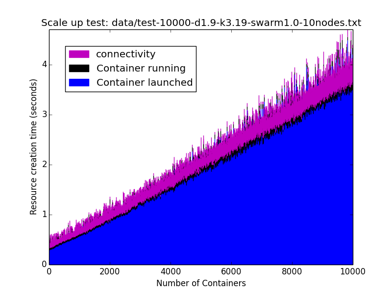

### Swarm on mesos, with Swarm manager as marathon managed app, 10 Nodes
We saw a significant latency and variance increase in this test with the number of deployed containers. We plan to investigate more on the root cause, however we suspect that one key issue is that we have been deploying Swarm manager in one of the nodes managed by swarm. It is possible that this is affecting the performances of Swarm manager.

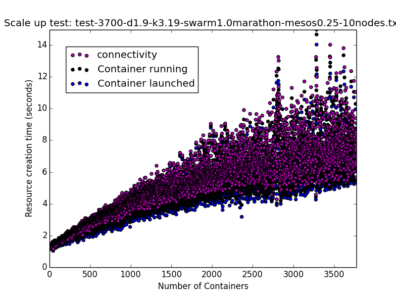

### Swarm on mesos, with Swarm manager deployed on the Mesos Master VM, 10 Nodes, offertimeout=1m
We observed improved latency and variance with this setup.

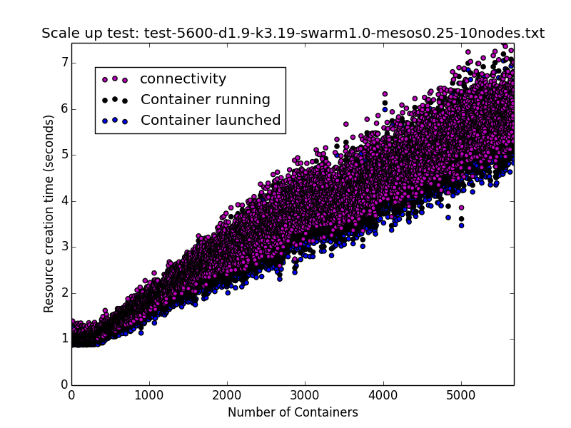

### Swarm on mesos, with Swarm manager deployed on the Mesos Master VM, 20 Nodes, offertimeout=10000m
We observed a further improvement in latency and variance with this setup.

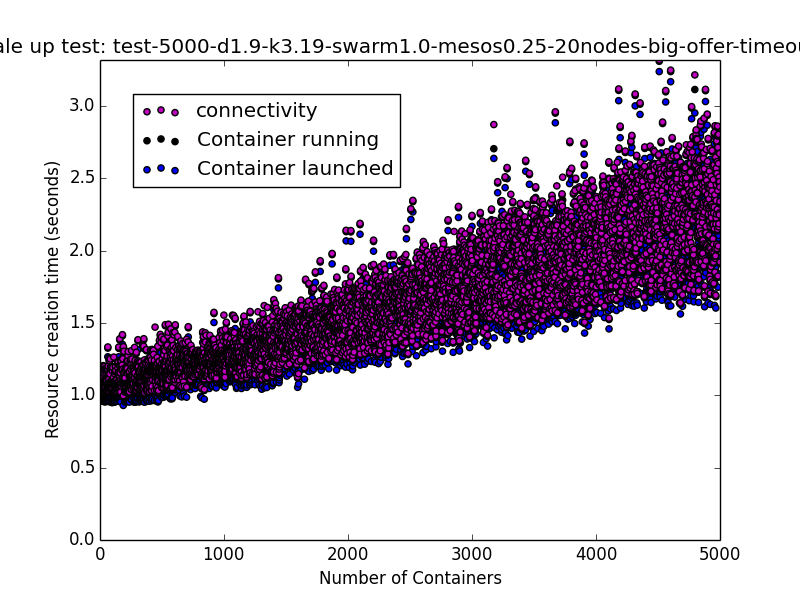

### Comparison
Here is a comparison of the baseline tests on Swarm standalone with Swarm on Mesos in the different configurations described above.

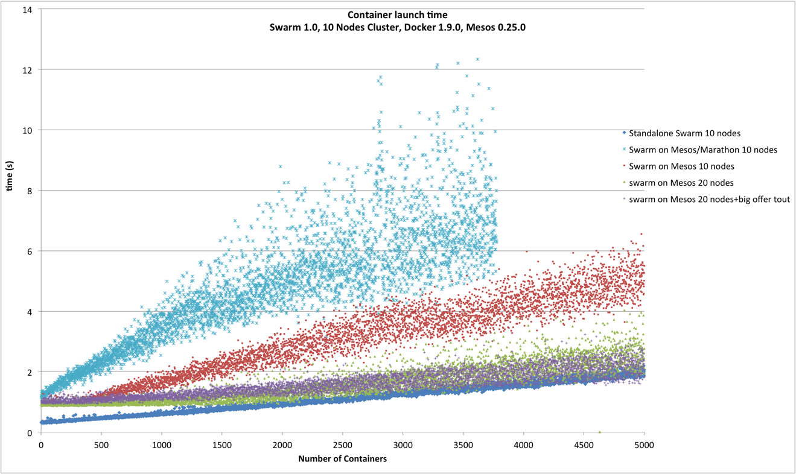

Since our initial tests on Swarm were performed on a 10 nodes cluster, we repeated the Swarm scalability test on the same 20 node cluster we used for the tests on Swarm on Mesos, and we compared the best results we obtained for Swarm on Mesos with stanadlone Swarm:

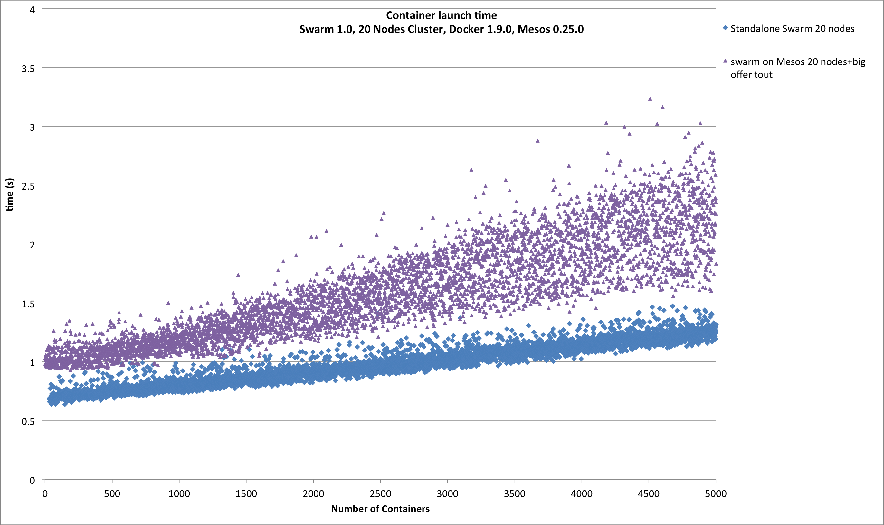

### Mesos logs analysis
We have processed the Mesos master and  to extract the time difference between different events during the test run. The following analysis applies
to Swarm on mesos, with Swarm manager deployed on the Mesos Master VM, 20 Nodes, offertimeout=10000m. The events and time differences being considered are the following:

### Master log
We have extracted the following metrics:

- t_sending_to_accept: time from sending an offer to the Swarm framework to the time the offer is accepted
- t_accept_to_adding: time from framework accepting an offer to when task is added for execution
- t_adding_to_running: time from when task was added to when is reported running
- offer_interval_time: time interval between offer sent by Mesos to the Swarm framework

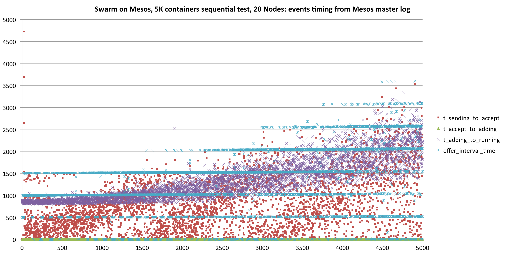

We have also verified that offers are always available to Swarm during the run, extracting the total number of offers available to the framework:


### Workers log

We have extracted the following metrics:

- t_assigned_to_launching_exec: time from when a task is assigned to when executor is launched
- t_launching_exec_to_starting_cont: time from when executor is launched to when container is launched
- t_starting_cont_to_registered_exec: time from when container is launched to when executor is registered
- t_registered_exec_to_running: time from when executor is registered to when container is launched

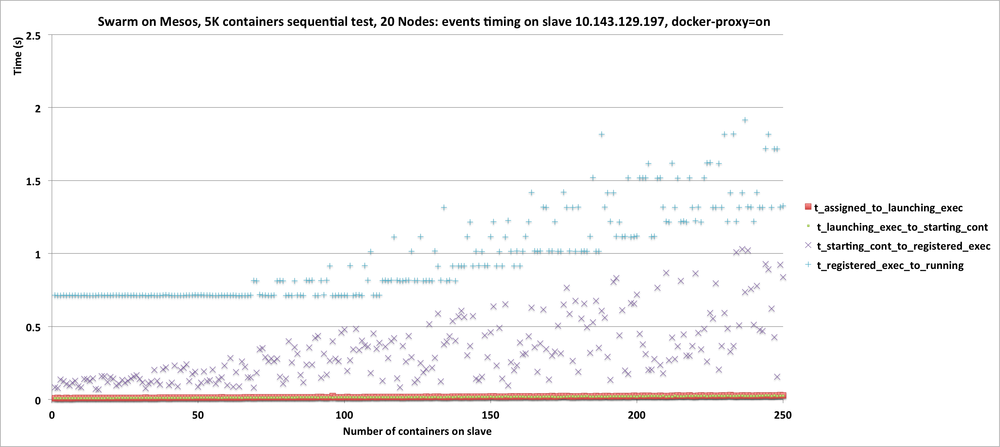

## Comparison with docker engine performance in the same worker node
To compare the Mesos executor execution path in the worker node with launching directly the container from the engine (as for example happens when running with standalone Swarm), we repeated the sequential test directly on the Mesos worker node invoking directly the engine with the docker CLI. The results are below:

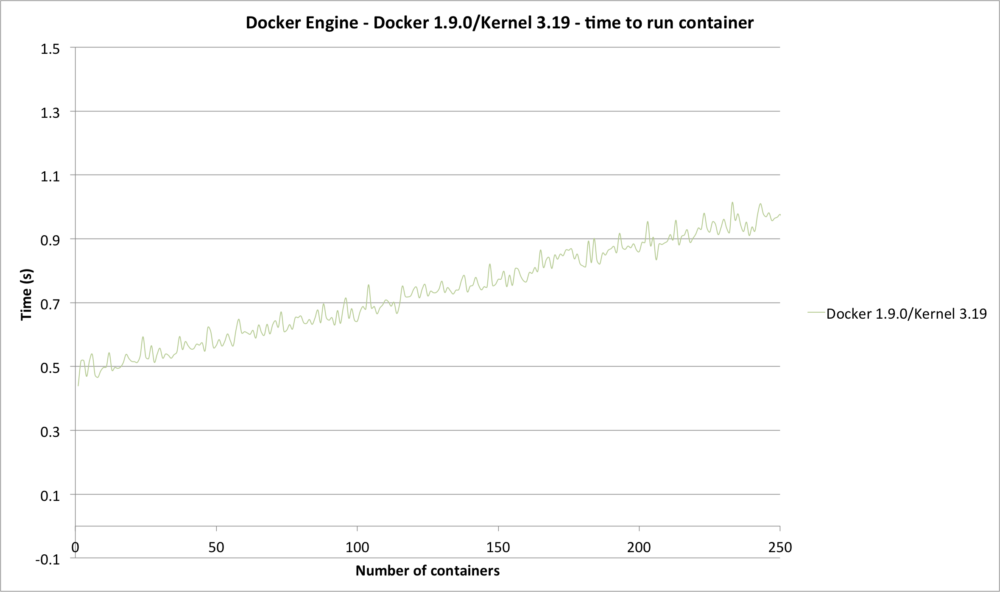

## System utilization

### Master node
The following plot illustrates a summary of the system utilization in the master node during the test, which took about 2 h 15 m to run.

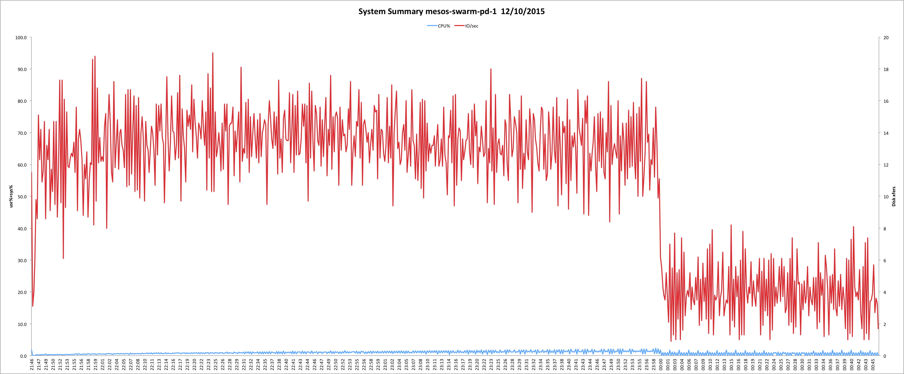

### Slave node
The following plot illustrates a summary of the system utilization in one of the worker nodes during the test.


#### Cumulative memory by process on worker node
We have also plotted the cumulative memory consumed by all processes during the run, based on top data.

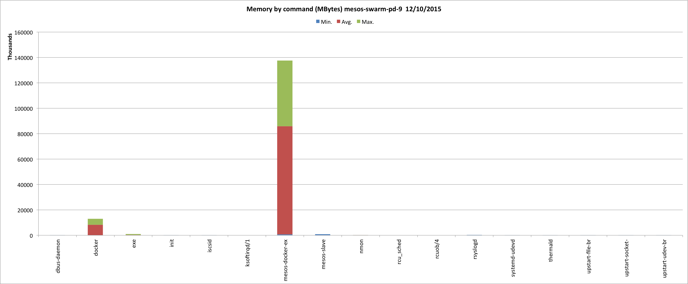

### Tunings on the workers
At the end of the test run we had a total of 5000 containers on 20 nodes, that is, 250 containers per worker node. Looking at the processes, we found that for each
container we had 3 processes:

- the process inside the container (httpd)
- the mesos docker executor
- the docker userland proxy

for a total of 750 processes. We decided to disable userland proxy (which is not needed with recent kernels) and ran a new 5k sequential scaling test.
We found an improvement of latency in the analysis of the log events for the workers, illustrated in the plot below:

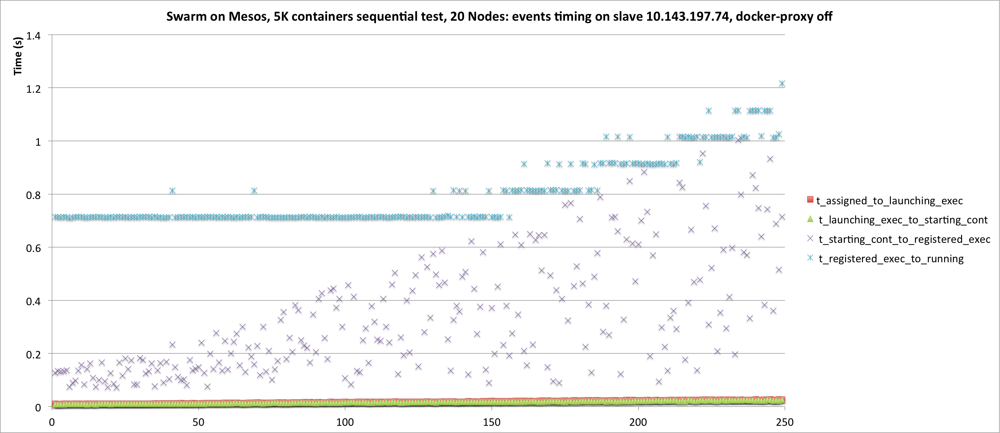

#### Comparison with previous results for worker events:

With userland proxy on:

| Events	| Average (ms)	| Std. Dev (ms)	| Median (ms)	| 90th Percentile(ms) |
|---------|---------------|---------------|-------------|---------------------|
| t_starting_cont_to_registered_exec	|		331.30 |	215.22 |	280	| 639.6 |
| t_registered_exec_to_running		|	981.59	| 304.47	| 817	| 1418.2 |


With userland proxy off:

| Events |Average (ms) |	Std. Dev (ms)	| Median (ms)	| 90th Percentile(ms) |
|--------|-------------|----------------|-------------|---------------------|
| t_starting_cont_to_registered_exec |	336.56| 220.39	| 275	| 661.2 |
| t_registered_exec_to_running	|		803.46	| 126.63	| 715	| 1015    |

#### Comparison with previous results

This is the summary for container launch time in 5k sequential test:

	| Userland Proxy | Average (ms)	| Std. Dev (ms)	| Median (ms)	| 90th Percentile(ms) |
  |----------------|--------------|---------------|-------------|---------------------|
	| on | 1424.23	| 445.99	| 1317	| 2073.1 |
	| off | 1352.95	| 394.51	| 1244	| 1941  |
