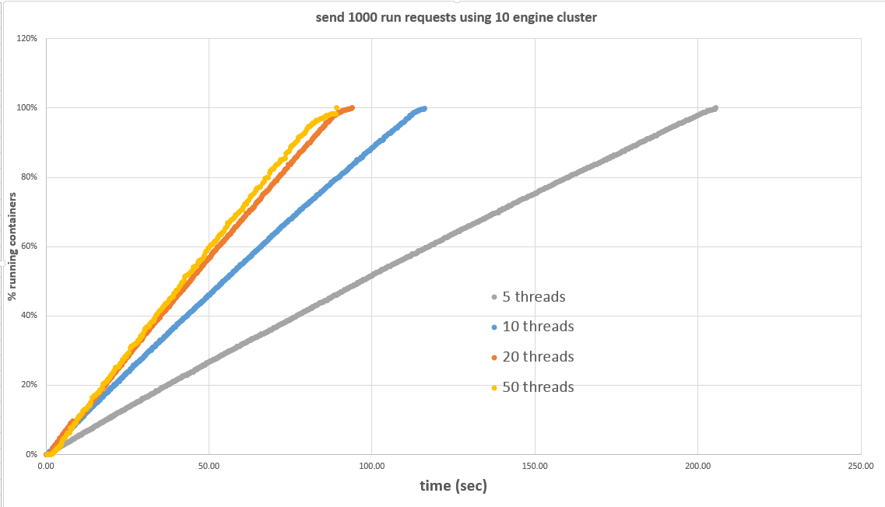

# Swarm on Mesos scalability tests

## Update (12\18\2015)
A new fix to the problematic lock was merged into latest Swarm (https://github.com/docker/swarm/commit/219f7192d67c2d3a215d9362cb03f2739323b199)

See description in: https://github.com/docker/swarm/issues/1495

## Environment tested

All tests are performed in a cluster of 10 nodes of SoftLayer virtual machines.

Hosts:
```
SoftLayer Public CCIs
1 master: 8 CPU / 16 GB RAM
10/20 workers: 8 CPU / 16 GB RAM
Ubuntu 14.04 LTS 64 bits
Kernel: Linux 3.19.0-31-generic #36~14.04.1-Ubuntu SMP Thu Oct 8 10:21:08 UTC 2015 x86_64 x86_64 x86_64 GNU/Linux
```
Docker version:
```
Client:
 Version:      1.9.0
 API version:  1.21
 Go version:   go1.4.2
 Git commit:   76d6bc9
 Built:        Tue Nov  3 17:43:42 UTC 2015
 OS/Arch:      linux/amd64

Server:
 Version:      1.9.0
 API version:  1.21
 Go version:   go1.4.2
 Git commit:   76d6bc9
 Built:        Tue Nov  3 17:43:42 UTC 2015
 OS/Arch:      linux/amd64
```
Mesos:
```
version 0.25.0
```
Swarm:
```
version 1.0.0 (official image from Docker Hub - https://hub.docker.com/_/Swarm/ )
```
We start Swarm with:
```
docker run -e Swarm_MESOS_USER=root -d -p 4375:2375 -p 3376:3375 --name Swarm Swarm manage -c mesos-experimental --cluster-opt mesos.address=0.0.0.0 --cluster-opt mesos.port=3376 --cluster-opt mesos.tasktimeout=10m --cluster-opt mesos.offertimeout=1m 1<Master-IP>:5050
```
## Throughput test
The test is similar to the sequential test (run busybox image and wait for it to start), and is performed by running multiple sender processes in parallel.

Each sender process does "docker create" and then "docker start". Note: the sender *does not* wait until the container is in running state.

After spawning multiple sender processes the master script performs a periodic "docker ps" and record the number of running containers as function of time

## Test results

### Swarm standalone
We performed the test on swarm standalone to get a baseline and compare with swarm on mesos.



### Swarm on Mesos
When running on Mesos, we found that throughput did not scale with the number of threads. We investigated in the code and found one issue with locks, and submitted a PR for it (https://github.com/docker/swarm/pull/1554). With the lock fix in place, we got the throughput to scale with the number of threads.


Summary (containers created / s):

| # Concurrent requests	| Engine	| Swarm	| Swarm-mesos	| Swarm-mesos w/ fix |
|---------|---------------|---------------|-------------|---------------------|
| 1	|		1.03 |	- |	-	| - |
| 5	|		1.44 |	4.9 |	-	| - |
| 10	|		1.51 |	8.9 |	-	| - |
| 20	|		- |	10.7 | 0.96	| 8.5 |
| 50	|		- |	11.22 |	-	| - |
